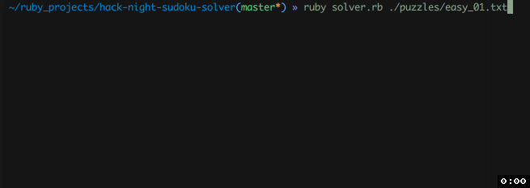

# Sudoku Solver


Sudoku is a logic puzzle played on a 9x9 square grid. The grid is further divided into 9 3x3 sections, as in the picture above.

The object of the game is to place the correct digits (1-9) in each square, given a partially completed grid as a starting point. The key is that no column, row, or 3x3 subsection can contain more than 1 of the same digit. In other words, each column, row and 3x3 subsection must contain all digits from 1 through 9.

## Set Up

You do not necessarily need to start with a pretty printable puzzle grid for this problem. In fact, I discourage you from spending too much time getting the UI to print perfectly. Begin with defining the logic for the game:

* What data structures do you need?
* How do you read and process the initial puzzle?
* How do you mark a space in the grid?
* How do decide what number goes into a space if there is more than one possibility?
* . . .

Once you have your game working with one of the easier puzzles, then work on displaying the grid.

This is a good problem to practice TDD. Your unit tests should reflect the rules of the game given above.

## Data

There are several puzzles in the */puzzles* folder. Some of the puzzles are easy while others will require advanced logic to complete. Begin with the easier puzzles before you move on to the more advanced logic.


## Resources

[Sudoku Wikipedia](https://en.wikipedia.org/wiki/Sudoku)

## Running code



```
ruby solver.rb ./puzzles/easy_01.txt
```
